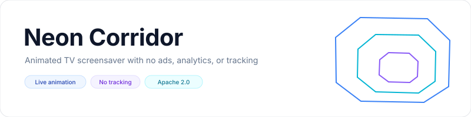
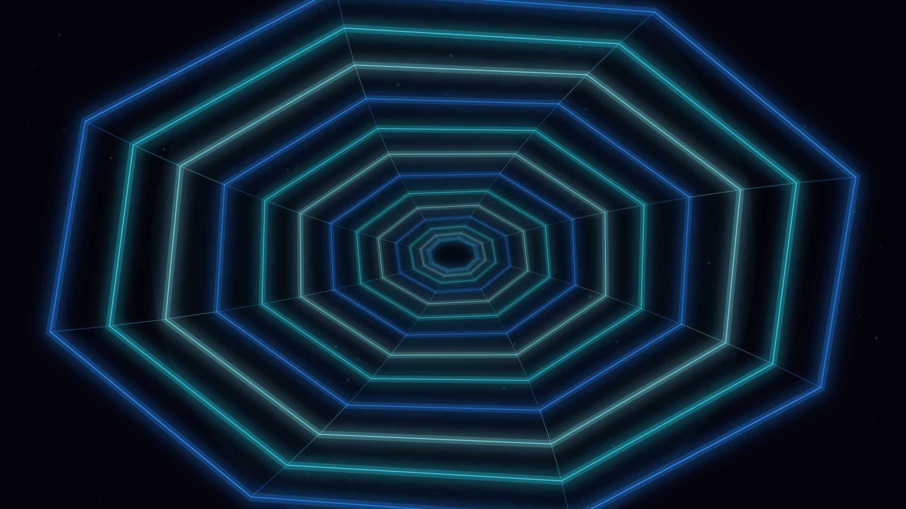

<p align="center">
    <picture>
        <source media="(prefers-color-scheme: dark)" srcset="art/banner-dark.svg">
        <source media="(prefers-color-scheme: light)" srcset="art/banner-light.svg">
        
    </picture>
</p>

<p align="center">A continuously animated neon tunnel for Fire TV, Android TV, and Google TV.</p>

<p align="center">
    <a href="https://github.com/jeremykenedy/neon-corridor/releases"></a>
    <a href="https://github.com/jeremykenedy/neon-corridor/releases"></a>
    <a href="https://github.com/jeremykenedy/neon-corridor/actions/workflows/ci.yml"></a>
    <a href="https://github.com/jeremykenedy/neon-corridor/actions/workflows/style.yml"></a>
    <a href="https://github.com/jeremykenedy/neon-corridor/actions/workflows/docs.yml"></a>
    <a href="https://github.com/jeremykenedy/neon-corridor/actions/workflows/security.yml"></a>
    <a href="LICENSE"></a>
    <a href="https://github.com/jeremykenedy"></a>
    <a href="https://github.com/jeremykenedy/neon-corridor" title="Open the repository and click Star"></a>
    <a href="https://github.com/jeremykenedy/neon-corridor/stargazers"></a>
    <a href="https://github.com/sponsors/jeremykenedy"></a>
</p>

<p align="center">Show some love by starring this repository on GitHub.</p>

## Table of contents

- [Privacy](#privacy)
- [Features](#features)
- [Requirements](#requirements)
- [Installation](#installation)
- [Configuration](#configuration)
- [Screenshots](#screenshots)
- [Building and testing](#building-and-testing)
- [Documentation](#documentation)
- [Release notes](#release-notes)
- [License](#license)

## Privacy

The app does not request network permission and contains no ads, analytics, telemetry, crash reporting, or tracking code. The tunnel and particles are rendered locally from Canvas primitives. The standalone installer contacts GitHub only after you start an install or update to fetch the current release APK and its checksum; it does not send device or usage data.

## Features

- Animated perspective tunnel with moving neon frames, corner struts, slow twist, and drifting particles.
- Electric cyan, synthwave, neon green, and prismatic color palettes.
- A few, handful, many, or a ton of tunnel layers; slow, natural, or fast movement; dim, balanced, or bright glow.
- Angular or rounded geometry, with random selection for each setting or all settings at startup.
- D-pad-friendly settings and a documented settings provider for host applications.
- Native Android DreamService for compatible TV screensaver managers.

## Requirements

- Android 6.0 (API 23) or later.
- A device with Android DreamService screensaver support.
- Android SDK platform 36 and build-tools 36.0.0 for source builds.

Device compatibility statements are limited to the checks in [verification](docs/VERIFICATION.md).

## Installation

Connect the TV with ADB, then run `python3 install.py --serial TV_IP:5555`. The installer downloads the latest signed release, checks its SHA-256, and installs or updates the app. Choose Neon Corridor in the TV's screensaver settings. For manual install, local builds, removal, and troubleshooting, see [installation](docs/INSTALLATION.md).

## Configuration

Open Neon Corridor from the TV launcher to change its settings. Options are saved locally and can be read or changed by an authorized host app through the versioned provider. See [configuration](docs/CONFIGURATION.md) for defaults and provider details.

## Screenshots

<p align="center">
    
</p>

This 1920 by 1080 screenshot was captured from the running Neon Corridor preview activity on an Android TV emulator. The in-app DreamService preview image is generated from the same running scene.

## Building and testing

```bash
bash build.sh
bash test.sh
bash scripts/test-python-coverage.sh
bash scripts/test-coverage.sh
```

The build uses the Android SDK and JDK. It generates a local signing key on the first build; keep the key and password outside the repository for future signed updates. See [building](docs/BUILDING.md), [testing](docs/TESTING.md), and [architecture](docs/ARCHITECTURE.md).

## Documentation

- [Installation, update, and removal](docs/INSTALLATION.md)
- [Configuration and settings provider](docs/CONFIGURATION.md)
- [Building from source](docs/BUILDING.md)
- [Architecture](docs/ARCHITECTURE.md)
- [Testing and coverage](docs/TESTING.md)
- [Device verification](docs/VERIFICATION.md)
- [CI](docs/CI.md)
- [Troubleshooting](docs/TROUBLESHOOTING.md)
- [Release process](docs/RELEASING.md)
- [Changelog](CHANGELOG.md)
- [Contribution guidelines](CONTRIBUTING.md)
- [Security policy](SECURITY.md)

## Release notes

- [Version 1.0.0](docs/releases/v1.0.0.md)

Show some love by starring this repository on GitHub: [Star Neon Corridor](https://github.com/jeremykenedy/neon-corridor/stargazers).

## License

Neon Corridor is licensed under the [Apache License, Version 2.0](LICENSE). See [NOTICE](NOTICE) for project notices.
